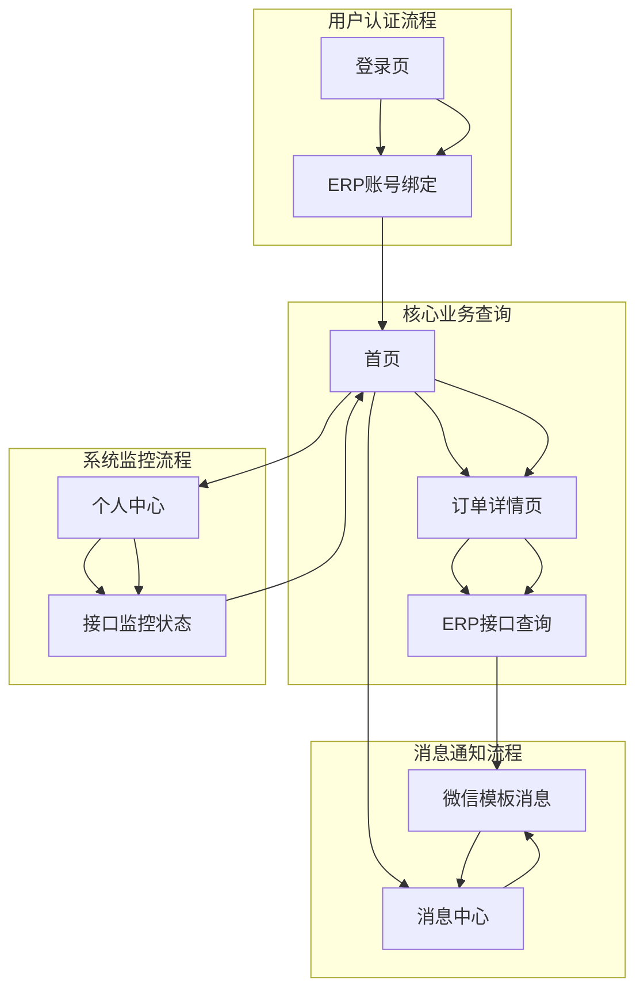

## 1. 产品概述

惠采订单信息查询微信小程序系统，专为零材料批发商与企业采购人员设计。系统采用无状态架构设计，通过ERP系统实时接口获取订单数据，取消本地数据库存储，专注于提供实时订单状态查询和微信模板消息通知功能。解决传统电话/微信沟通效率低、易出错的问题，实现订单状态实时追踪和关键节点自动通知。

目标用户：零材料批发商、企业采购人员。核心价值：提升订单处理效率，降低沟通成本，增强客户信任度，确保数据实时性和一致性。

## 2. 核心功能

### 2.1 用户角色

| 角色     | 注册方式      | 核心权限                  |
| ------ | --------- | --------------------- |
| 企业采购员  | 微信小程序授权注册 | 查询关联企业订单状态、接收微信模板消息通知 |
| 批发商管理员 | ERP系统账号同步 | 查看系统接口监控状态、用户反馈管理     |

### 2.2 功能模块

系统包含以下核心页面：

1. **首页**：订单状态查询、快速搜索、接口状态监控
2. **订单详情页**：实时订单状态、物料进度追踪、状态时间轴
3. **消息中心**：微信模板消息通知记录、通知设置
4. **个人中心**：用户信息、关联企业、系统状态
5. **登录页**：微信授权登录、ERP账号绑定

### 2.3 页面详情

| 页面名称  | 模块名称    | 功能描述                      |
| ----- | ------- | ------------------------- |
| 首页    | 订单状态查询  | 通过ERP接口实时查询用户关联企业的所有订单状态  |
| 首页    | 快速搜索    | 支持订单号、物料名称关键词实时搜索，调用ERP接口 |
| 首页    | 接口监控    | 显示ERP接口调用状态、响应时间、错误率      |
| 订单详情页 | 实时订单状态  | 从ERP系统实时获取订单基本信息、当前状态     |
| 订单详情页 | 物料进度追踪  | 实时查询物料生产进度、分批发货状态         |
| 订单详情页 | 状态时间轴   | 展示订单各状态节点的变更时间和持续时长       |
| 消息中心  | 模板消息记录  | 显示微信模板消息发送记录、阅读状态         |
| 消息中心  | 通知设置    | 配置接收通知类型、免打扰时间            |
| 个人中心  | 用户信息    | 显示用户姓名、关联企业、微信头像          |
| 个人中心  | 系统状态    | 显示ERP连接状态、数据同步时间、接口健康度    |
| 登录页   | 微信授权    | 通过微信授权获取用户信息，绑定ERP账号      |
| 登录页   | ERP账号绑定 | 输入ERP系统账号密码完成绑定验证         |

## 3. 核心流程

### 企业采购员使用流程

用户通过微信授权登录小程序，绑定ERP系统账号。系统通过ERP接口实时验证用户身份和关联企业信息。采购员可在首页实时查询所有关联企业的订单状态，点击订单查看详情和物料进度。系统通过ERP接口实时获取最新数据，不存储任何订单数据到本地。当订单状态发生关键变更时，系统自动发送微信模板消息通知。

### 系统接口监控流程

系统实时监控ERP接口调用状态，记录响应时间、错误率和数据一致性。当接口异常时，系统立即通知管理员并记录故障信息。所有接口调用都有完整的日志记录，确保问题可追溯。系统定期检测ERP数据同步状态，确保用户查询到的数据准确无误。

## 4. 用户界面设计

### 4.1 设计风格

* **主色调**：深蓝色 (#1890FF) 体现专业可靠，辅助色为浅灰色 (#F5F5F5)，状态异常时使用橙色 (#FA8C16)

* **按钮样式**：圆角矩形，主要操作为实心按钮，次要操作为边框按钮，禁用状态使用灰色

* **字体**：微信小程序默认字体，标题18px，正文14px，辅助文字12px，错误提示使用红色

* **布局风格**：卡片式布局，信息层级清晰，留白充足，接口状态显示在页面顶部

* **图标风格**：使用微信官方图标库，简洁线性风格，接口状态使用动态图标

### 4.2 页面设计概览

| 页面名称  | 模块名称  | UI元素                             |
| ----- | ----- | -------------------------------- |
| 首页    | 订单卡片  | 圆角卡片设计，显示订单号、客户名、状态标签（不同状态用不同颜色） |
| 首页    | 搜索栏   | 顶部固定搜索框，灰色背景，支持扫码和手动输入           |
| 订单详情页 | 状态时间轴 | 垂直时间轴展示订单各阶段完成时间，当前状态高亮显示        |
| 物料追踪页 | 进度条   | 水平进度条显示物料生产/发货进度，百分比精确展示         |
| 个人中心  | 信息卡片  | 用户头像圆形显示，企业信息列表式展示               |

### 4.3 响应式设计

采用微信小程序原生组件，自动适配不同屏幕尺寸。重点优化触摸交互体验，按钮点击区域不小于44px×44px，支持滑动操作和手势返回。

### 4.4 微信小程序规范遵循

* 完全符合微信小程序设计规范

* 不使用诱导分享、强制关注等违规功能

* 用户隐私数据获取遵循最小必要原则

* 所有页面加载时间控制在3秒以内

* 支持微信深色模式适配

