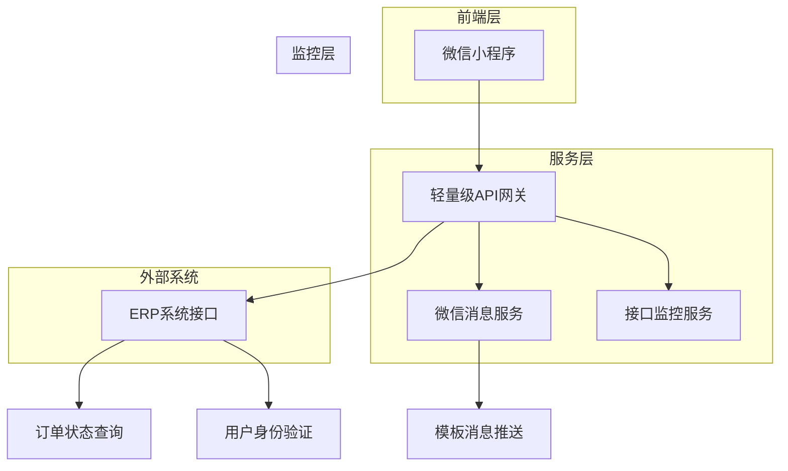
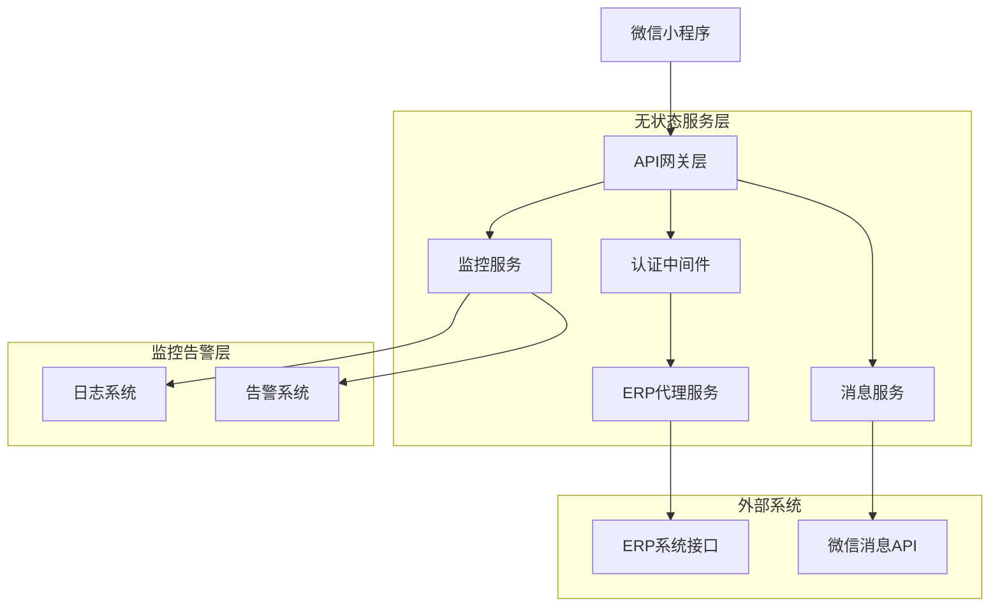
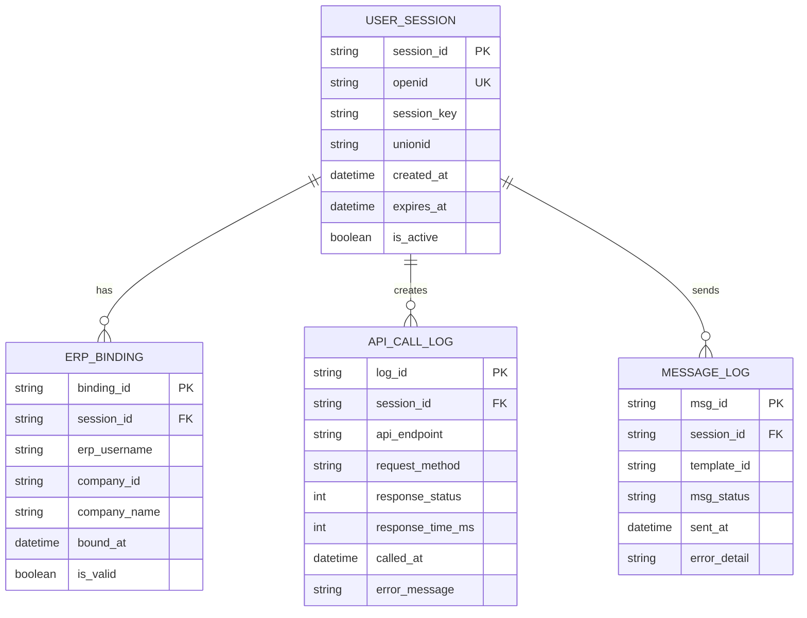

## 1. 架构设计



## 2. 技术描述

* **前端**：微信小程序原生框架 + TypeScript

* **后端**：轻量级Node.js服务（Express框架）

* **部署环境**：腾讯云云开发环境

* **第三方集成**：ERP系统实时接口（snowbeasts\_apis.py）

* **消息推送**：微信官方模板消息API

* **数据存储**：无状态设计，不存储业务数据

* **监控服务**：接口健康检查、性能监控、错误日志

## 3. 路由定义

| 路由                           | 用途        |
| ---------------------------- | --------- |
| /api/auth/wx-login           | 微信小程序登录验证 |
| /api/auth/erp-bind           | ERP账号绑定验证 |
| /api/orders/search           | 实时查询订单信息  |
| /api/orders/<id>/status      | 获取订单实时状态  |
| /api/orders/<id>/materials   | 获取订单物料清单  |
| /api/materials/<id>/progress | 获取物料生产进度  |
| /api/wechat/template-msg     | 发送微信模板消息  |
| /api/user/profile            | 获取用户信息    |
| /api/health/check            | 系统健康检查    |
| /api/erp/status              | ERP接口状态监控 |
| /api/metrics/performance     | 接口性能指标查询  |

## 4. API定义

### 4.1 核心API

#### 微信小程序登录

```
POST /api/auth/wx-login
```

请求参数：

| 参数名      | 参数类型   | 是否必需 | 描述       |
| -------- | ------ | ---- | -------- |
| code     | string | true | 微信登录code |
| userInfo | object | true | 微信用户信息   |

响应参数：

| 参数名        | 参数类型   | 描述       |
| ---------- | ------ | -------- |
| sessionKey | string | 微信会话密钥   |
| openid     | string | 微信用户唯一标识 |
| unionid    | string | 微信用户统一标识 |

#### ERP账号绑定

```
POST /api/auth/erp-bind
```

请求参数：

| 参数名         | 参数类型   | 是否必需 | 描述       |
| ----------- | ------ | ---- | -------- |
| openid      | string | true | 微信用户标识   |
| erpUsername | string | true | ERP系统用户名 |
| erpPassword | string | true | ERP系统密码  |

响应参数：

| 参数名         | 参数类型    | 描述     |
| ----------- | ------- | ------ |
| bindStatus  | boolean | 绑定状态   |
| companyInfo | object  | 关联企业信息 |
| permissions | array   | 用户权限列表 |

#### 实时订单查询

```
GET /api/orders/search
```

请求参数：

| 参数名     | 参数类型   | 是否必需  | 描述     |
| ------- | ------ | ----- | ------ |
| openid  | string | true  | 微信用户标识 |
| keyword | string | false | 搜索关键词  |
| status  | string | false | 订单状态筛选 |
| page    | number | false | 页码，默认1 |

响应参数：

| 参数名       | 参数类型    | 描述             |
| --------- | ------- | -------------- |
| orders    | array   | 订单列表（实时从ERP获取） |
| total     | number  | 总数量            |
| queryTime | string  | 查询时间戳          |
| cacheHit  | boolean | 是否命中缓存         |

#### 微信模板消息发送

```
POST /api/wechat/template-msg
```

请求参数：

| 参数名        | 参数类型   | 是否必需  | 描述      |
| ---------- | ------ | ----- | ------- |
| openid     | string | true  | 接收者微信标识 |
| templateId | string | true  | 模板消息ID  |
| data       | object | true  | 模板数据    |
| page       | string | false | 跳转页面路径  |

响应参数：

| 参数名      | 参数类型   | 描述   |
| -------- | ------ | ---- |
| msgid    | string | 消息ID |
| status   | string | 发送状态 |
| sendTime | string | 发送时间 |

## 5. 服务器架构图



## 6. 数据模型

### 6.1 数据模型定义

由于系统采用无状态设计，不存储业务数据，仅保留必要的用户认证和会话信息：



### 6.2 数据定义语言

#### 用户会话表 (user\_sessions)

```sql
CREATE TABLE user_sessions (
    session_id VARCHAR(64) PRIMARY KEY COMMENT '会话ID',
    openid VARCHAR(100) NOT NULL COMMENT '微信openid',
    session_key VARCHAR(128) COMMENT '微信会话密钥',
    unionid VARCHAR(100) COMMENT '微信unionid',
    created_at TIMESTAMP DEFAULT CURRENT_TIMESTAMP,
    expires_at TIMESTAMP NOT NULL COMMENT '过期时间',
    is_active BOOLEAN DEFAULT TRUE COMMENT '是否有效',
    INDEX idx_openid (openid),
    INDEX idx_expires_at (expires_at)
) ENGINE=InnoDB DEFAULT CHARSET=utf8mb4 COMMENT='用户会话表';
```

#### ERP绑定关系表 (erp\_bindings)

```sql
CREATE TABLE erp_bindings (
    binding_id VARCHAR(64) PRIMARY KEY COMMENT '绑定ID',
    session_id VARCHAR(64) NOT NULL COMMENT '会话ID',
    erp_username VARCHAR(100) NOT NULL COMMENT 'ERP用户名',
    company_id VARCHAR(50) COMMENT '企业ID',
    company_name VARCHAR(200) COMMENT '企业名称',
    bound_at TIMESTAMP DEFAULT CURRENT_TIMESTAMP,
    is_valid BOOLEAN DEFAULT TRUE COMMENT '是否有效',
    INDEX idx_session_id (session_id),
    INDEX idx_erp_username (erp_username)
) ENGINE=InnoDB DEFAULT CHARSET=utf8mb4 COMMENT='ERP绑定关系表';
```

#### API调用日志表 (api\_call\_logs)

```sql
CREATE TABLE api_call_logs (
    log_id VARCHAR(64) PRIMARY KEY COMMENT '日志ID',
    session_id VARCHAR(64) COMMENT '会话ID',
    api_endpoint VARCHAR(200) NOT NULL COMMENT 'API端点',
    request_method VARCHAR(10) NOT NULL COMMENT '请求方法',
    request_params TEXT COMMENT '请求参数',
    response_status INT COMMENT '响应状态码',
    response_data TEXT COMMENT '响应数据',
    response_time_ms INT COMMENT '响应时间毫秒',
    error_message TEXT COMMENT '错误信息',
    called_at TIMESTAMP DEFAULT CURRENT_TIMESTAMP,
    INDEX idx_session_id (session_id),
    INDEX idx_api_endpoint (api_endpoint),
    INDEX idx_called_at (called_at)
) ENGINE=InnoDB DEFAULT CHARSET=utf8mb4 COMMENT='API调用日志表';
```

#### 消息发送日志表 (message\_logs)

```sql
CREATE TABLE message_logs (
    msg_id VARCHAR(64) PRIMARY KEY COMMENT '消息ID',
    session_id VARCHAR(64) NOT NULL COMMENT '会话ID',
    template_id VARCHAR(100) NOT NULL COMMENT '模板ID',
    msg_content TEXT COMMENT '消息内容',
    msg_status VARCHAR(20) DEFAULT 'sent' COMMENT '发送状态',
    sent_at TIMESTAMP DEFAULT CURRENT_TIMESTAMP,
    error_detail TEXT COMMENT '错误详情',
    INDEX idx_session_id (session_id),
    INDEX idx_template_id (template_id),
    INDEX idx_sent_at (sent_at)
) ENGINE=InnoDB DEFAULT CHARSET=utf8mb4 COMMENT='消息发送日志表';
```

### 初始化数据

```sql
-- 插入测试会话数据
INSERT INTO user_sessions (session_id, openid, session_key, unionid, expires_at) VALUES 
('session_001', 'test_openid_1', 'session_key_1', 'unionid_1', DATE_ADD(NOW(), INTERVAL 30 DAY)),
('session_002', 'test_openid_2', 'session_key_2', 'unionid_2', DATE_ADD(NOW(), INTERVAL 30 DAY));

-- 插入测试绑定数据
INSERT INTO erp_bindings (binding_id, session_id, erp_username, company_id, company_name) VALUES 
('bind_001', 'session_001', 'test_user1', 'COMP001', '测试企业1'),
('bind_002', 'session_002', 'test_user2', 'COMP002', '测试企业2');
```

## 7. 接口监控与一致性保证

### 7.1 接口健康监控

* **实时监控**：每30秒检测ERP接口可用性

* **性能指标**：响应时间、成功率、错误率统计

* **告警机制**：接口异常时立即通知管理员

* **故障切换**：接口异常时启用备用查询通道

### 7.2 数据一致性保证

* **实时查询**：所有订单数据均通过ERP接口实时获取

* **缓存策略**：仅对用户会话和基础配置进行缓存

* **数据校验**：对比ERP返回数据与预期格式的一致性

* **异常处理**：数据格式异常时记录日志并返回友好提示

### 7.3 性能优化策略

* **连接池管理**：维护ERP接口连接池，减少连接建立开销

* **请求合并**：合并多个相关查询请求，减少接口调用次数

* **缓存机制**：对频繁查询的基础数据进行短期缓存

* **异步处理**：消息推送采用异步队列处理

### 7.4 错误处理机制

* **重试策略**：接口调用失败时自动重试，最多3次

* **降级方案**：ERP接口异常时返回缓存数据或友好提示

* **日志记录**：详细记录所有接口调用和错误信息

* **用户提示**：前端显示清晰的错误信息和解决方案

## 8. 微信小程序审核合规

### 7.1 合规要求

* 用户隐私保护：仅获取必要的用户信息

* 服务内容合规：仅提供货物追踪服务，不涉及违规内容

* 用户体验优化：页面加载速度控制在3秒内

* 消息推送规范：使用订阅消息，不强制推送

### 7.2 技术实现

* 使用HTTPS协议进行所有网络请求

* 用户数据加密存储，敏感信息脱敏处理

* 实现完善的错误处理和用户反馈机制

* 支持微信登录态自动续期机制

